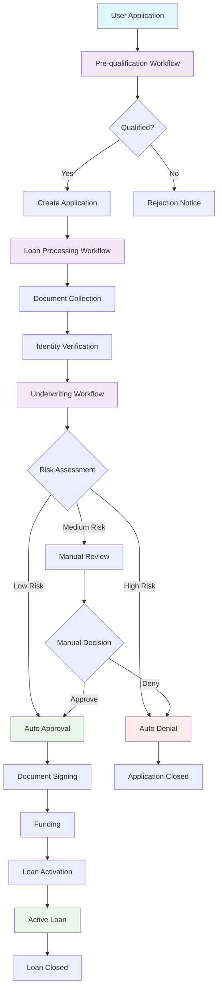
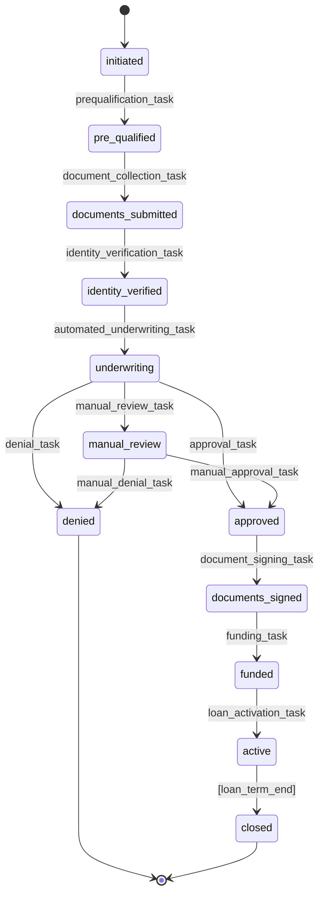
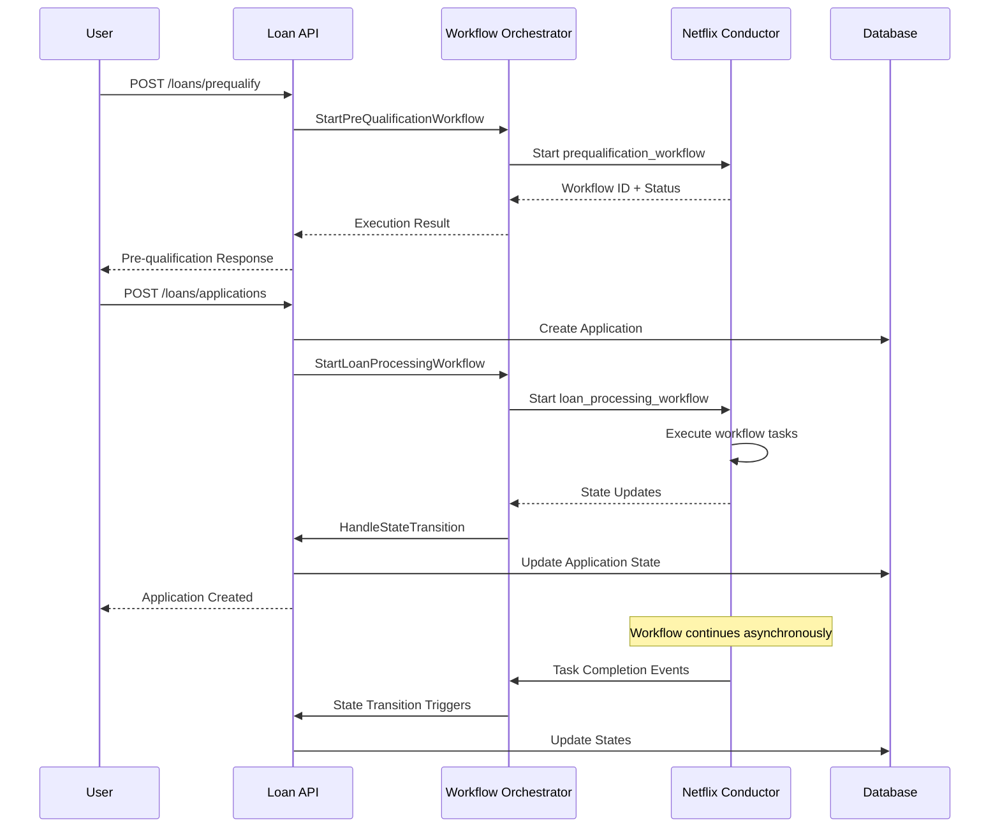

# Loan Service - Workflow Visual Diagrams

## 🔄 Complete Loan Processing Workflow



## 🎯 State Machine Diagram



## 🔀 Workflow Orchestration Flow



## 📊 Netflix Conductor Workflow Definition

### Pre-qualification Workflow
```json
{
  "name": "prequalification_workflow",
  "version": 1,
  "tasks": [
    {
      "name": "validate_input",
      "taskReferenceName": "validate_input_ref",
      "type": "SIMPLE"
    },
    {
      "name": "calculate_dti",
      "taskReferenceName": "calculate_dti_ref", 
      "type": "SIMPLE"
    },
    {
      "name": "assess_risk",
      "taskReferenceName": "assess_risk_ref",
      "type": "SIMPLE"
    },
    {
      "name": "generate_terms",
      "taskReferenceName": "generate_terms_ref",
      "type": "SIMPLE"
    }
  ],
  "schemaVersion": 2
}
```

### Loan Processing Workflow
```json
{
  "name": "loan_processing_workflow",
  "version": 1,
  "tasks": [
    {
      "name": "validate_application",
      "taskReferenceName": "validate_application_ref",
      "type": "SIMPLE"
    },
    {
      "name": "document_collection",
      "taskReferenceName": "document_collection_ref",
      "type": "HUMAN"
    },
    {
      "name": "identity_verification", 
      "taskReferenceName": "identity_verification_ref",
      "type": "SIMPLE"
    },
    {
      "name": "trigger_underwriting",
      "taskReferenceName": "trigger_underwriting_ref",
      "type": "SUB_WORKFLOW",
      "subWorkflowParam": {
        "name": "underwriting_workflow",
        "version": 1
      }
    }
  ],
  "schemaVersion": 2
}
```

### Underwriting Workflow
```json
{
  "name": "underwriting_workflow", 
  "version": 1,
  "tasks": [
    {
      "name": "credit_check",
      "taskReferenceName": "credit_check_ref",
      "type": "SIMPLE"
    },
    {
      "name": "income_verification",
      "taskReferenceName": "income_verification_ref", 
      "type": "SIMPLE"
    },
    {
      "name": "risk_assessment",
      "taskReferenceName": "risk_assessment_ref",
      "type": "SIMPLE"
    },
    {
      "name": "decision_engine",
      "taskReferenceName": "decision_engine_ref",
      "type": "DECISION",
      "caseValueParam": "riskScore",
      "decisionCases": {
        "high_risk": [
          {
            "name": "manual_review",
            "taskReferenceName": "manual_review_ref",
            "type": "HUMAN"
          }
        ],
        "low_risk": [
          {
            "name": "auto_approve",
            "taskReferenceName": "auto_approve_ref", 
            "type": "SIMPLE"
          }
        ]
      },
      "defaultCase": [
        {
          "name": "auto_deny",
          "taskReferenceName": "auto_deny_ref",
          "type": "SIMPLE"
        }
      ]
    }
  ],
  "schemaVersion": 2
}
```

## 🎮 Workflow Task Definitions

### Simple Tasks
```json
{
  "name": "validate_application",
  "description": "Validates loan application data",
  "retryCount": 3,
  "timeoutSeconds": 300,
  "inputKeys": ["applicationData"],
  "outputKeys": ["validationResult", "errors"]
}
```

### Human Tasks  
```json
{
  "name": "manual_review",
  "description": "Manual underwriting review",
  "retryCount": 0,
  "timeoutSeconds": 86400,
  "inputKeys": ["applicationData", "riskAssessment"],
  "outputKeys": ["decision", "comments"]
}
```

### Decision Tasks
```json
{
  "name": "decision_engine", 
  "description": "Automated decision based on risk score",
  "retryCount": 1,
  "timeoutSeconds": 60,
  "inputKeys": ["riskScore", "applicationData"],
  "outputKeys": ["decision", "reason"]
}
```

## 🔧 Workflow Workers

### Worker Implementation Pattern
```go
type WorkflowWorker struct {
    conductorClient ConductorClient
    logger          *zap.Logger
}

func (w *WorkflowWorker) ProcessTask(task *ConductorTask) (*TaskResult, error) {
    switch task.TaskType {
    case "validate_application":
        return w.validateApplication(task)
    case "credit_check":
        return w.performCreditCheck(task)
    case "risk_assessment":
        return w.assessRisk(task)
    default:
        return nil, fmt.Errorf("unknown task type: %s", task.TaskType)
    }
}
```

## 📈 Monitoring & Metrics

### Workflow Metrics
- **Execution Time**: Average workflow completion time
- **Success Rate**: Percentage of successful workflow executions  
- **Failure Rate**: Percentage of failed workflows
- **Task Duration**: Individual task execution times
- **Queue Depth**: Number of pending tasks

### Business Metrics
- **Application Volume**: Number of applications per day
- **Approval Rate**: Percentage of approved applications
- **Manual Review Rate**: Percentage requiring manual review
- **Time to Decision**: Average time from application to decision
- **Funding Time**: Average time from approval to funding

## 🚨 Error Handling & Recovery

### Retry Policies
```json
{
  "retryPolicy": {
    "retryOn": ["TASK_FAILED"],
    "maxRetries": 3,
    "retryDelaySeconds": 30,
    "backoffRate": 2.0
  }
}
```

### Circuit Breaker Pattern
```json
{
  "circuitBreaker": {
    "enabled": true,
    "failureThreshold": 5,
    "timeoutSeconds": 60,
    "resetTimeoutSeconds": 300
  }
}
```

### Dead Letter Queue
- Failed tasks after all retries
- Manual intervention required
- Alerting and monitoring
- Data recovery procedures

---

*This visual documentation provides a comprehensive view of the loan service workflow architecture, from high-level process flows to detailed Conductor configurations.*
